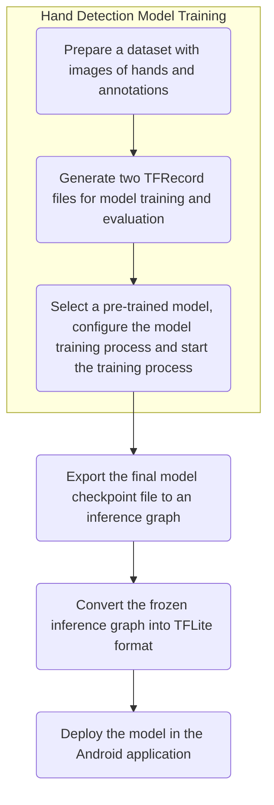

# Method

## Proposed Method
### State Diagram of the Android Lantern Interactive Information Wall


After the Lantern is powered on, it launches the Android application and shows the Home page of the Information Wall. There are 3 items with the title of "News", "Gallery" and "Department Staff Information".

#### Workflow of Hand Detection Process for the Implementation of Interactive Feature
 \

The camera module keeps capturing image. For each image captured, the MainActivity passes it to an Interpreter for hand detection.

A hand detection model is trained to recognize a hand. The interpreter utilizes the model to conduct the inference in each image and returns the detection results to the MainActivity after the inference process completes. If there are more than one results, the MainActivity selects the best result and records the result's location on the projected area.

When a user's hand moves into the projected area of the Lantern, a hand indicator is shown on the UI which visualizes the location of the hand on the projected area for the user to navigate the pages in the Android application. When the user's hand moves away from the projected area of the Lantern, the hand indicator disappears.

To trigger a "click" event, the user first controls the hand indicator by waving his/her hand, then moves the hand indicator to the desired position on the UI and finally moves away his/her hand from the projected area of the Lantern. The "click" event is triggered based on the last position where the hand indicator appeared on the UI.

In the Home page, if the last position of the hand indicator was shown on the News item, the News item is clicked and the Android application navigates to the News landing page where there are 3 titles of the news articles shown on the page. An item of the news articles is clicked if the last position of the hand indicator was shown on it, bringing user to the details page of the selected news article. The user can navigate up to the previous page or Home page by moving the hand indicator to the "Back" button or the "Go Home" button on the top navigation bar. This "clicking" and navigation processes are also applied to the pages of Department Staff Information.

The Gallery is a page for photo slideshow only. There are a total of 6 photos and each of them stays on the UI for 6 seconds before it is switched to another photo. User can "click" on the "Back" button or "Go Home" button to return to the Home page.

**Google Cloud Firestore** is being used to be the database of the Android application storing all the data of the New, Gallery and the Department Staff Information pages. It is a NoSQL database where data is called document and referenced using a path. It also provides API that could be used in the Android application to retrieve data with ease.

## Implementation
### User Interface of Android application
#### Fragments

The News page, Gallery page, Department Staff Information page and their inner pages exist as fragments in the Android application. A graphical version of the navigation graph in `mobile_navigation.xml` is shown below.

 \

### Hand Detection Model Training Process
Training a hand detection model is one of the vital steps to enable a user interacting with the virtual graphic projected on a wall.

I have applied **transfer learning** technique to enable rapid development of a hand detection model. A well pre-trained TensorFlow object detection model is reused and re-trained its final layer of the neutral network with minimal training data and less computational power to classify new class label, i.e. hand.



The training process of a hand detection model based on a pre-trained Object Detection model using TensorFlow Object Detection API involves 3 essential steps.

1. Prepare a dataset with images of hands and annotations.

	For each image, the locations of hands are annotated, which are the minimum value of the x axis and the maximum value of the y axis (`xmin`, `ymax`) as well as the maximum value of the x axis and the minimum value of the y axis (`xmax`, `ymin`).
	
	All the images in the dataset are of the same dimension with the image that is going to be recognized by the model. In this project, the Raspberry Pi camera module captures images with a dimension of 1280 x 720 so the dimension of the images in the dataset are also 1280 x 720.
	
	The images are separated into two folders, one for model training and another one for model evaluation. In each image folder, there is a CSV file which contains all the essential information about the images under the folder, the coordinates of the hand(s) in each image and the class label - `hand`.
	
	In `train_labels.csv`,

	```
	filename,width,height,class,xmin,ymin,xmax,ymax
	CHESS_COURTYARD_BT_frame1038.jpg,1280,720,hand,771,638,1031,718
	...
	```
2. Generate two TFRecord files from the CSV files by running [`generate_tfrecord.py`](https://github.com/datitran/raccoon_dataset/blob/master/generate_tfrecord.py).

	A TFRecord file contains all the information stated in a CSV file as well as the images' bytes. After the TFRecord files are generated, the images and CSV files are no longer needed.
	
3. Download a pre-trained Object Detection model, configure the model training process and start the model training by running Python scripts.
	
	I have selected quantized SSD MobileNet V1 and V2 pre-trained object detection model from [Tensorflow detection model zoo](https://github.com/tensorflow/models/blob/master/research/object_detection/g3doc/detection_model_zoo.md) for the re-training process. This is because currently only SSD MobileNet models can be converted into TFLite format, which is optimized to be executed efficiently on mobile and embedded devices with limited computational and memory resources like mobile phones and Raspberry Pi.

	I have to modify a few lines in `pipeline.config` under the pre-trained model folder so as to customise the training pipeline and strategy suitable for my dataset.

	- `num_classes: 1`. There is only one class label - hand.
	- Set the `num_steps:` to the total number of training steps for the hand detection model.
	- Set the `num_examples:` to the total number of evaluation steps for the hand detection model.
	- Set the `fine_tune_checkpoint:` to the path of `model.ckpt` under the pre-trained model folder.
	- Set the `input_path:` under the `train_input_reader:` and `eval_input_reader:` sections to the location of TFRecord files for model training and evaluation respectively.
	- Set the `label_map_path:` to the location of a label map in `.pbtxt` format.
	I have created a `hands_label_map.pbtxt` for the hand detection model training process.
	
		```
		item {
			id: 1
			name: 'hand'
		}
		```

	To start training a hand detection model, I have run the `object_detection/model_main.py`, or `object_detection/legacy/train.py` plus `object_detection/legacy/eval.py` under the [TensorFlow models' object detection repository](https://github.com/tensorflow/models/tree/master/research).

After the training process has finished, I have to export the final model checkpoint file to an inference graph by running `object_detection/export_tflite_ssd_graph.py`. Then, `tflite_graph.pb` and `tflite_graph.pbtxt` are generated. The frozen inference graph is then converted into TFLite format by using the command `tflite_convert`.
```
tflite_convert \
--output_file=".../hand_detect.tflite" \
--graph_def_file="../tflite_graph.pb" \
--inference_type=QUANTIZED_UINT8 \
--input_arrays=normalized_input_image_tensor \
--output_arrays='TFLite_Detection_PostProcess',
				'TFLite_Detection_PostProcess:1',
				'TFLite_Detection_PostProcess:2',
				'TFLite_Detection_PostProcess:3' \
--mean_values=128 \
--std_dev_values=128 \
--input_shapes=1,300,300,3 \
--change_concat_input_ranges=false \
--allow_nudging_weights_to_use_fast_gemm_kernel=true \
--allow_custom_ops
```
It is notable that the `input_shapes` of the pre-trained SSD MobileNet model is set to be 300 x 300, meaning that an image which is going to be recognized should have the same dimension.

#### Using EgoHands dataset for Hand Detection Model Training
From [Victor Dibia's hand detector project](https://github.com/victordibia/handtracking), I learned about the EgoHands dataset prepared by Indiana University. This dataset has 4,401 images for model training and 401 images for model evaluation and I found that this dataset is in high quality.

- Hands in the images are big and can be seen clearly. This is because all the images are captured from an egocentric view by Google Glasses.
- All images are in the same dimension of 1280 x 720, the HD standard format.

{width=50%} {width=50%}
{width=50%} {width=50%}

The [`egohands_dataset_clean.py`](https://github.com/victordibia/handtracking/blob/master/egohands_dataset_clean.py) provided in Victor Dibia's hand detector project helps me to download the dataset from the website, clean the files in the dataset and generate two CSV files, `train_labels.csv` and `test_labels.csv`. The cleaning process includes

- reading the `polygons.mat` files which contains the annotations of the hand bounding boxes in all the images,
- renaming all the filename of the images to make sure each filename is unique, and
- spliting the dataset, i.e. images, into two folders, around 83% for training and 10% for testing.

Then, I have to run `generate_tfrecord.py` to generate two TFRecord files, `train.record` and `test.record` for model training and evaluation respectively. The hand detection model training and evaluation run smoothly without any error using Python 2.7 and the SSD MobileNet V1/V2 pre-trained model. I am also able to frozen the inference graph of the model and convert it in TFLite format.

### Hand Detection in Android application
To perform hand detection in the Android application, I have to add the hand detection model file in TFLite format to the Android application project's `assets` folder, capture images from the camera module and call suitable methods provided by TensorFlow for inference using the model.

#### Image Capturing in Android application
After reviewing the [TensorFlow Object Detection demo project](https://github.com/tensorflow/examples/tree/master/lite/examples/object_detection/android) [@tensorflow-demo-app], I found that I am able to obtain the byte array of an image captured by a preview view from the `onPreviewFrame` callback method provided in `Camera.PreviewCallback` class which belongs to the Camera API.

The parameter `bytes` is the image byte buffer and `addCallbackBuffer(bytes)` enables the callback method being called continuously whenever an image is available on the preview view. To obtain an image byte buffer using Camera API, I can just override the `onPreviewFrame` of `Camera.PreviewCallback` class and set up the camera as well as the preview view.
```kotlin
val previewCallback = Camera.PreviewCallback { bytes, camera ->
    ...
    camera.addCallbackBuffer(bytes)
}
...
private val IMAGE_WIDTH = 1280
private val IMAGE_HEIGHT = 720
...
// camera setup
val parameters = camera.parameters
...
parameters.setPreviewSize(IMAGE_WIDTH, IMAGE_HEIGHT)
camera.parameters = parameters
...
// camera preview view setup
camera.setPreviewCallbackWithBuffer(previewCallback)
camera.addCallbackBuffer(ByteArray(ImageUtils.getYUVByteSize(
        IMAGE_WIDTH, IMAGE_HEIGHT)))
camera.startPreview()
```

#### Processing an Image to Detect a Hand
As the hand detection model can only accept an image bitmap with a dimension of 300 x 300 while the image captured from the camera module has a dimension of 1280 x 720, I have to create a matrix `frameToCropTransform` which shrinks the original size of the image to fit the one required by the hand detection model using a utility method `getTransformationMatrix` provided by the [`ImageUtils.java` class](https://github.com/tensorflow/examples/blob/master/lite/examples/object_detection/android/app/src/main/java/org/tensorflow/lite/examples/detection/env/ImageUtils.java) in the demo project.
```kotlin
private val TF_OD_API_INPUT_SIZE = 300

frameToCropTransform = ImageUtils.getTransformationMatrix(
            IMAGE_WIDTH, IMAGE_HEIGHT,
            TF_OD_API_INPUT_SIZE, TF_OD_API_INPUT_SIZE,
            0, MAINTAIN_ASPECT)
```

The preview view captured an image in YUV format but the hand detection model only works on a bitmap in RGB format. Therefore, I have to do a conversion on the image format. For each image captured by the preview view, I just passed the byte buffer to another utility method `convertYUV420SPToARGB8888` in `ImageUtils.java` to perform conversion of image format.
```kotlin
val previewCallback = Camera.PreviewCallback { bytes, camera ->
	ImageUtils.convertYUV420SPToARGB8888(bytes, IMAGE_WIDTH,
	        IMAGE_HEIGHT, rgbBytes)
	        
	processImage() // Perform hand detection inside this method
	...
}
...
private fun processImage() {
	rgbFrameBitmap.setPixels(rgbBytes, 0, IMAGE_WIDTH, 0, 0,
		IMAGE_WIDTH, IMAGE_HEIGHT)
	...
}
```
After a bitmap in RGB format is prepared, I have used the [`Classifier.java`](https://github.com/tensorflow/examples/blob/master/lite/examples/object_detection/android/app/src/main/java/org/tensorflow/lite/examples/detection/tflite/Classifier.java) and [`TFLiteObjectDetectionAPIModel.java`](https://github.com/tensorflow/examples/blob/master/lite/examples/object_detection/android/app/src/main/java/org/tensorflow/lite/examples/detection/tflite/TFLiteObjectDetectionAPIModel.java) class provided by the demo project for hand detection. `recognizeImage()` is the only method that I need to detect a hand in the image. This method accepts a bitmap with a dimension of 300 x 300 and returns a list of `Classifier.Recognition` objects if hands are detected in the image.
```kotlin
private var detector: Classifier? = null

private val croppedBitmap = Bitmap
	.createBitmap(TF_OD_API_INPUT_SIZE, TF_OD_API_INPUT_SIZE,
		Bitmap.Config.ARGB_8888)
...

private fun processImage() {
	...
	// Prepare a cropped Bitmap of an image
	// with a dimension of 300 * 300
	val canvas = Canvas(croppedBitmap)
    canvas.drawBitmap(rgbFrameBitmap, frameToCropTransform,
	    Paint())
	
	// detect a hand in the image
	val results = detector?.recognizeImage(croppedBitmap)
	...
}
```

#### Hand Position Tracking on UI
I am able to obtain the position of hand in the image by calling the method `getLocation()` for each `Classifier.Recognition` object. To notify the user whether a hand has been detected, I have added a custom view `TrackingView` and draw a red dot showing the location of the user's hand on the UI by overriding the `onDraw()` method.

In `TrackingView.kt`,
```kotlin
override fun onDraw(canvas: Canvas) {
	...
	canvas.drawCircle(x, y, 30f, paint)
	...
}
```
In `MainActivity.kt`, since there may be many results returned from `recognizeImage`, I choose the best result, i.e. the one with the highest confidence, to be the location of hand being shown on the UI.
```kotlin
private fun processImage() {
	...
	for (i in handResults.indices) {
	  if (handResults[i].confidence > bestHandResult.confidence)
	    bestHandResult = handResults[i]
	}
	...
	val location = bestHandResult.location
    trackingView.drawHandSpot(location.centerX(),
	    location.centerY())
}
```
The method `getLocation()` (written in `.location` for Kotlin) returned a `RectF` object and I decided to draw the red dot, i.e. the hand position indicator on UI, using the center x and y of the `RectF` object.

 \

Since the image is has been resized to 300 x 300 for hand detection, I have to resize the image back to its original dimension of 1280 x 720 by calling the `invert()` method of the `Matrix` class. Similarly, the center x and y coordinates of the `RectF` object have to be transformed so that the location of the hand can be correctly shown on the UI. This can be done by calling the `mapRect()` method of the `Matrix` class.

#### Custom MotionEvent for Click Action
After I have obtained the location of the hand in an image, I can implement the feature enabling the user to "click" the virtual graphics with the hand in a simple way.

In `activity_main.xml`, I have added a `ConstraintLayout` which covers the entire UI to ensure all the items shown on the UI are clickable.
```xml
<androidx.constraintlayout.widget.ConstraintLayout
	android:id="@+id/content_view"
    android:layout_width="match_parent"
    android:layout_height="match_parent"
    tools:context=".MainActivity">

	<!-- toolbar layout -->
	<!-- content page layout -->
</androidx.constraintlayout.widget.ConstraintLayout>
```
In `MainActivity.kt`, I have created a custom `MotionEvent` using the location of hand in an image and called the `dispatchTouchEvent()` method of the `ViewGroup` class.
```kotlin
contentView = findViewById(R.id.content_view)
...
private fun addMotionEvent(x: Float, y: Float, act: Int) {
	...
	val motionEvent = MotionEvent.obtain(..., act, x, y,...)
	
    // Dispatch touch event to view
    contentView.dispatchTouchEvent(motionEvent)
}
```
If a hand can be detected across the frames in the preview view, `MotionEvent.ACTION_DOWN` takes place. At the moment when a hand can no longer be detected in the current frame captured by the preview view, i.e. user moves the hand away from visible area of the camera module, `MotionEvent.ACTION_UP` takes place in order to trigger the "click" action.
```kotlin
private fun processImage() {
	...
	if (handResults?.size!! > 0) {
		...
		addMotionEvent(centerX, centerY, MotionEvent.ACTION_DOWN)
		...
	} else {
		...
		if ((centerX >= 0f) && (centerY >= 0f)) {
		  // hand previously being detected has moved away
		  // trigger click action
		  addMotionEvent(centerX, centerY, MotionEvent.ACTION_UP)
		  ...
		}
	}
	...
}
```
