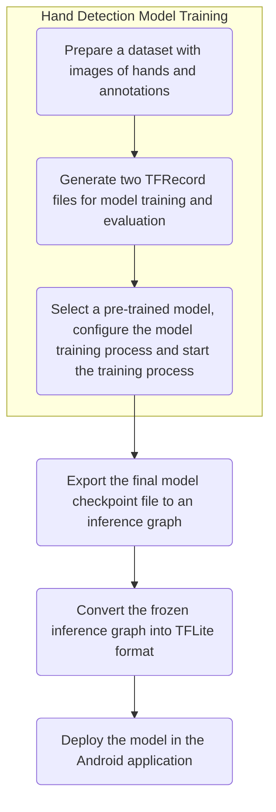

# Method

## Proposed Method
### State Diagram of the Android Lantern Interactive Information Wall


After the Lantern is powered on, it launches the Android application and shows the Home page of the Information Wall. There are 3 items with the title of "News", "Gallery" and "Department Staff Information".

#### Workflow of Hand Detection Process for the Implementation of Interactive Feature
 \

The camera module keeps capturing image. For each image captured, the MainActivity passes it to an Interpreter for hand detection.

A hand detection model is trained to recognize a hand. The interpreter utilizes the model to conduct the inference in each image and returns the detection results to the MainActivity after the inference process completes. If there are more than one results, the MainActivity selects the best result and records the result's location on the projected area.

When a user's hand moves into the projected area of the Lantern, a hand indicator is shown on the UI which visualizes the location of the hand on the projected area for the user to navigate the pages in the Android application. When the user's hand moves away from the projected area of the Lantern, the hand indicator disappears.

To trigger a "click" event, the user first controls the hand indicator by waving his/her hand, then moves the hand indicator to the desired position on the UI and finally moves away his/her hand from the projected area of the Lantern. The "click" event is triggered based on the last position where the hand indicator appeared on the UI.

In the Home page, if the last position of the hand indicator was shown on the News item, the News item is clicked and the Android application navigates to the News landing page where there are 3 titles of the news articles shown on the page. An item of the news articles is clicked if the last position of the hand indicator was shown on it, bringing user to the details page of the selected news article. The user can navigate up to the previous page or Home page by moving the hand indicator to the "Back" button or the "Go Home" button on the top navigation bar. This "clicking" and navigation processes are also applied to the pages of Department Staff Information.

The Gallery is a page for photo slideshow only. There are a total of 6 photos and each of them stays on the UI for 6 seconds before it is switched to another photo. User can "click" on the "Back" button or "Go Home" button to return to the Home page.

**Google Cloud Firestore** is being used to be the database of the Android application storing all the data of the New, Gallery and the Department Staff Information pages. It is a NoSQL database where data is called document and referenced using a path. It also provides API that could be used in the Android application to retrieve data with ease.

## Implementation
### User Interface of Android application
#### Fragments

The News page, Gallery page, Department Staff Information page and their inner pages exist as fragments in the Android application. A graphical version of the navigation graph in `mobile_navigation.xml` is shown below.

 \

In `activity_main.xml`, all the layout of the fragments defined in `mobile_navigation.xml` will be connected to the fragment layout below so that user can navigate around the Android application to view different pages.
```xml
<fragment
	android:id="@+id/nav_host_fragment"
	android:name="androidx.navigation.fragment.NavHostFragment"
    ...
    app:defaultNavHost="true"
    app:navGraph="@navigation/mobile_navigation" />
```
The use of fragments allows easy implementation of navigation in the Android application. In `mobile_navigation.xml`, I can add an `action` tag to link up two fragments. Here is an example showing that the home fragment is linked up with the New, Gallery as well as the Department Staff Information pages' fragments.
```xml
<fragment
  android:id="@+id/nav_home"
  android:name="com.example.lanterninfowall.ui.home.HomeFragment"
  tools:layout="@layout/home_fragment">
  <action
     android:id="@+id/action_nav_home_to_nav_gallery"
     app:destination="@id/nav_gallery" />
  <action
     android:id="@+id/action_nav_home_to_nav_news"
     app:destination="@id/nav_news" />
  <action
     android:id="@+id/action_nav_home_to_nav_staffinfo"
     app:destination="@id/nav_staffinfo" />
</fragment>
```
In `MainActivity.kt`, calling 
```kotlin
findNavController(R.id.nav_host_fragment).navigate(R.id.nav_news)
```
will bring the user to the News page's fragment, and calling
```kotlin
findNavController(R.id.nav_host_fragment).navigateUp()
```
will bring the user back to previous page's fragment.

#### Data Binding with Observable Data Objects and MVVM Architecture
Data binding is a popular alternative approach to the standard `findViewById()` method for binding data to UI components using a declarative format.

In `staff_info_item_fragment.xml`,
```xml
<TextView
	...
	android:text="@{staff.name}"
	... />
<TextView
	...
	android:text="@{staff.title}"
	... />
```

The MVVM stands for Model-View-ViewModel. The main advantage of using the MVVM architecture in mobile applications is to decouple the UI's logic from the main program's logic, making the application easier to mange.

In the Android application, I have created ViewModel classes which declare all the relevant data to be shown in the page layouts. For each page, say the News landing page, there are one fragment class, a XML layout file and a ViewModel class to achieve data binding.

I have applied one-way data binding in the Android application.

 \

The fragment class contains all the programming logic including retrieving data from the database but it will not directly interact with the UI components in the layout. Instead, a ViewModel class instance is created in the fragment. The ViewModel class, together with a fragment-specific data binding class, can be seen as the middle persons responsible for the communication between the fragment class and the XML layout file.

For example, in `NewsFragment.kt`,
```kotlin
class NewsFragment : Fragment() {
	...
	private lateinit var viewModel: NewsViewModel
	
	// fragment-specific data binding class
	private lateinit var binding: NewsFragmentBinding
	...
	override fun onCreateView(...): View? {
        binding = NewsFragmentBinding.inflate(...).apply {
            ...
            vm = ViewModelProvider(this)
					.get(NewsViewModel::class.java)
        }
		...
	}
}
```
As there are lots of news articles and department staff information in the database, `RecyclerView` is used in the layout of the News and Department Staff Information landing pages showing the thumbnails which consist of the news headings and the names of the staff respectively.

In `news_fragment.xml`,
```xml
<data>
  <variable
	name="vm"
	type="com.example.lanterninfowall.ui.staffinfo.NewsViewModel" />
</data>
...
<androidx.recyclerview.widget.RecyclerView
 ...
 app:itemBinding="@{vm.newsItemBinding}"
 app:items="@{vm.newsItems}"
 app:layoutManager="androidx.recyclerview.widget.LinearLayoutManager"/>
```
In `NewsViewModel.kt`,
```kotlin
val newsItems = ObservableArrayList<NewsItemViewModel>()

val newsItemBinding = ItemBinding.of<NewsItemViewModel>
						(BR.news, R.layout.news_item_fragment)
```
A ViewModel class has class attributes which refer to all the relevant data to be shown on the UI. With the help of the ViewModel class and data binding, I can easily create thumbnails and bind them to the `RecyclerView` by using the binding adapters `items` and `itemBinding` in the XML layout file as well as the `ItemBinding` class in the ViewModel class.

Additionally, I have to create another ViewModel class and XML layout file for each thumbnail.

In `news_item_fragment.xml`,
```xml
<data>
  ...
  <variable
	name="news"
	type="com.example.lanterninfowall.ui.home.NewsItemViewModel"/>
</data>
...
<TextView
	...
	android:text="@{news.heading}"
	... />
```

In `NewsItemViewModel.kt`,
```kotlin
class NewsItemViewModel : ViewModel() {
	...
	val heading = MutableLiveData<String>().apply { value = "" }
}
```
The `Observable` and `MutableLiveData` classes are used along with data binding to enable automatic real-time updates on the data fields of the UI components.

Back to the `NewsFragment.kt`, I have instantiated an object of the thumbnail's ViewModel class and assigned values to the class attributes for each data of the news items retrieved from the database.
```kotlin
binding.vm?.apply {

	FirebaseFirestore.getInstance().collection("news")
				.addSnapshotListener { querySnapshot, exception ->
				
		newsItems.clear()
		newsItems.addAll(querySnapshot?.documents?.map { doc ->
		
			// instantiate a thumbnail's ViewModel object
	        val item = NewsItemViewModel()
	        ...
	        // assign the value retrieved from the database
	        // to the class attribute of the ViewModel object
	        item.heading.value = doc.getString("heading")
	        ...
	    }
	}
}	
```
For each assignment, the UI components of a thumbnail are notified and they update the data fields to display the newly assigned values. Then, the UI component --- `RecyclerView` in the `news_fragment.xml` is notified to display the UI components of the thumbnail. The procedures repeat until the fragment class has done the mapping for all the news item data, therefore, a number of thumbnails are shown on the News landing page. This strategy is also applied to the Department Staff Information landing page.

Taking the advantage of the observable data objects and data binding, I have used the `addSnapshotListener()` callback method of the Google Cloud Firestore API in the fragments so that whenever there is new data inserted into the database, the callback method will be triggered and the UI components as well as their data fields will be automatically updated. This is particularly useful for the pages in which data is constantly changing, like the news articles in the News pages.

If ViewModel class and data binding are not used, we have to call `findViewById()` method to bind data to the layout so the main program's logic will be mixed with the UI's logic. Moreover, without using the `MutableLiveData`, we have to manually call `postInvalidate()` for each UI components so as to update the data field. These makes the main program to be lengthy and hard to manage.

#### Fragment Transition for Slideshow in Gallery page
In the Gallery page, taking the advantage of data binding with the `FragmentManager.beginTransaction()` and `handler.postDelayed()` methods, I am able to achieve image slideshow by just creating two instances of slideshow item fragment to show many images and their associated information on the UI.

With the help of the ViewModel and data binding classes, I can reuse the two slideshow item fragments so as to keep the program logic to be as minimal as possible. Before the fragment transaction begins, I assigned all the values retrieved from the database to another item fragment's ViewModel class attributes. As the `MutableLiveData` object can notify the UI to update the changes on the data fields, after the `commit()` method for the fragment transition is called, the data fields showing the image and its information in text form are automatically updated.

In `gallery_fragment.xml`,
```xml
<androidx.constraintlayout.widget.ConstraintLayout
	android:id="@+id/slideshow">
    ...
</androidx.constraintlayout.widget.ConstraintLayout>
```
In `GalleryFragment.kt`,
```kotlin
val fragment = itemFragments[itemFragmentIndex++ % 2]
...
GalleryItemFragmentBinding.vm?.let {
	it.photoURL.value = ...
	it.alt.value = ...
    it.qrcodeURL.value = ...
}

fm.beginTransaction()
  .addToBackStack(null)
  .setCustomAnimations(android.R.anim.slide_in_left,
					  android.R.anim.slide_out_right)
  .replace(R.id.slideshow, fragment)
  .commit()

handler.postDelayed(this, 6000)
```
By repeating the procedures of ViewModel attributes' assignment to another item fragment, the two instances of slideshow item fragment can interchange with each other, showing different images and text each time.

In order to keep the slideshow item staying on the screen for a few seconds, say 6 seconds, I have applied the `handler.postDelayed()` method to add delays between the ViewModel attributes' assignment and the fragment transition

Since the images for the slideshow can be constantly changing, it is impossible to download all the images to the Android application and load them within the application. To resolve this issue, I have used the `load()` method of Coil, an image loading library specialized for Android application.

I have to first create a `BindingAdapters.kt` class.
```kotlin
object BindingAdapters {  
    @BindingAdapter("app:imageSrc")  
    @JvmStatic fun setImageSrc(view: ImageView, src:String) {  
        view.load(src)  
    }  
}
```
Then I am able to assign a URL of the image in `String` form to the binding adapter in the layout file through the corresponding ViewModel attribute.

In `GalleryFragment.kt`,
```kotlin
GalleryItemFragmentBinding.vm?.let {
	it.photoURL.value =
		"https://www.comp.hkbu.edu.hk/v1/pic/news/971.jpg"
	...
}
```
In `gallery_item_fragment.xml`,
```xml
<ImageView
	...
    app:imageSrc="@{vm.photoURL}"
    ... />
```
Finally, the image will be loaded if the URL can be accessed without any problem.

### Hand Detection Model Training Process
Training a hand detection model is one of the vital steps to enable a user interacting with the virtual graphic projected on a wall.

I have applied **transfer learning** technique to enable rapid development of a hand detection model. A well pre-trained TensorFlow object detection model is reused and re-trained its final layer of the neutral network with minimal training data and less computational power to classify new class label, i.e. hand.



The training process of a hand detection model based on a pre-trained Object Detection model using TensorFlow Object Detection API involves 3 essential steps.

1. Prepare a dataset with images of hands and annotations.

	For each image, the locations of hands are annotated. For each location of a hand, there are two coordinates associated with it, which are the minimum value of the x axis and the maximum value of the y axis (`xmin`, `ymax`) as well as the maximum value of the x axis and the minimum value of the y axis (`xmax`, `ymin`).
	
	All the images in the dataset are of the same dimension with the image that is going to be recognized by the model. In this project, the Raspberry Pi camera module captures images with a dimension of 1280 x 720 so the dimension of the images in the dataset are also 1280 x 720.
	
	The images are separated into two folders, one for model training and another one for model evaluation. In each image folder, there is a CSV file which contains all the essential information about the images under the folder, the coordinates of the hand(s) in each image and the class label - `hand`.
	
	In `train_labels.csv`,

	```
	filename,width,height,class,xmin,ymin,xmax,ymax
	CHESS_COURTYARD_BT_frame1038.jpg,1280,720,hand,771,638,1031,718
	JENGA_OFFICE_HT_frame1805.jpg,1280,720,hand,290,367,414,704
	PUZZLE_COURTYARD_HT_frame1237.jpg,1280,720,hand,525,268,672,419
	...
	```
2. Generate two TFRecord files from the CSV files by running [`generate_tfrecord.py`](https://github.com/datitran/raccoon_dataset/blob/master/generate_tfrecord.py).

	A TFRecord file contains all the information stated in a CSV file as well as the images' bytes. After the TFRecord files are generated, the images and CSV files are no longer needed.
	
3. Download a pre-trained Object Detection model, configure the model training process and start the model training by running Python scripts.
	
	I have selected quantized SSD MobileNet V1 and V2 pre-trained object detection model from [Tensorflow detection model zoo](https://github.com/tensorflow/models/blob/master/research/object_detection/g3doc/detection_model_zoo.md) for the re-training process. This is because currently only SSD MobileNet models can be converted into TFLite format, which is optimized to be executed efficiently on mobile and embedded devices with limited computational and memory resources like mobile phones and Raspberry Pi.

	I have to modify a few lines in `pipeline.config` under the pre-trained model folder so as to customise the training pipeline and strategy suitable for my dataset.

	- `num_classes: 1`. There is only one class label - hand.
	- Set the `num_steps:` to the total number of training steps for the hand detection model.
	- Set the `num_examples:` to the total number of evaluation steps for the hand detection model.
	- Set the `fine_tune_checkpoint:` to the path of `model.ckpt` under the pre-trained model folder.
	- Set the `input_path:` under the `train_input_reader:` and `eval_input_reader:` sections to the location of TFRecord files for model training and evaluation respectively.
	- Set the `label_map_path:` to the location of a label map in `.pbtxt` format.
	I have created a `hands_label_map.pbtxt` for the hand detection model training process.
	
		```
		item {
			id: 1
			name: 'hand'
		}
		```

	To start training a hand detection model, I have run the `object_detection/model_main.py`, or `object_detection/legacy/train.py` plus `object_detection/legacy/eval.py` under the [TensorFlow models' object detection repository](https://github.com/tensorflow/models/tree/master/research). The `model_main.py` is the newer Python script for training of object detection model. This program enables the model training and evaluation to be done at the same time. In another words, the training of model starts first, then after a certain period of time, the training process is stopped and evaluation of the model starts. After the evaluation is done, the training process starts again. The training and evaluation processes are done alternatively throughout until the final step of the model training is reached. If legacies are used for the hand detection model training, I have to run the `train.py` first, following by the `eval.py` so as to achieve training and evaluating the model at the same time.

After the training process has finished, I have to export the final model checkpoint file to an inference graph by running `object_detection/export_tflite_ssd_graph.py`. Then, `tflite_graph.pb` and `tflite_graph.pbtxt` are generated. The frozen inference graph is then converted into TFLite format by using the command `tflite_convert`.
```
tflite_convert \
--output_file=".../hand_detect.tflite" \
--graph_def_file="../tflite_graph.pb" \
--inference_type=QUANTIZED_UINT8 \
--input_arrays=normalized_input_image_tensor \
--output_arrays='TFLite_Detection_PostProcess',
				'TFLite_Detection_PostProcess:1',
				'TFLite_Detection_PostProcess:2',
				'TFLite_Detection_PostProcess:3' \
--mean_values=128 \
--std_dev_values=128 \
--input_shapes=1,300,300,3 \
--change_concat_input_ranges=false \
--allow_nudging_weights_to_use_fast_gemm_kernel=true \
--allow_custom_ops
```
It is notable that the `input_shapes` of the pre-trained SSD MobileNet model is set to be 300 x 300, meaning that an image which is going to be recognized should have the same dimension. As my hand detection model is re-trained from a pre-trained model, I have to follow the configuration of the pre-trained model for my hand detection model.

####  Problems of University of Oxford's Hand Dataset
I have first tried using the hand dataset prepared by University of Oxford to train a hand detection model. This dataset has 4,070 images for model training and 822 images for model evaluation.

In Loïc Marie's Hands Detection project, the [`create_inputs_from_dataset.py`](https://github.com/loicmarie/hands-detection/blob/master/create_inputs_from_dataset.py) helps me to download the dataset from the website, read the hand annotation files in `.mat` format and generate TFRecord files. I have used the `hands_train.record` and `hands_val.record` for my hand detection model training. I have chosen the SSD MobileNet V1 pre-trained model and started the training by running the `object_detection/model_main.py`

***Errors encountered:***

I first started the model training process in a Docker machine installed on Macbook Pro through VirtualBox. 
The target number of training steps is 6,000 and Python 2.7 was used to execute the Python script. The training was started without any error, however, during the model evaluation, I found that the detection precision was always zero. VirtualBox is a software used for virtualization, hence making the Docker container becoming a virtual machine instead. As hardware is virtualized under virtual machines, I believed that there were some problems or errors occurred during the accessing of the computer’s hardware resources.

After I had started the training using Python 3.6 on Macbook Pro, the `TypeError: object of type <class 'numpy.float64'> cannot be safely interpreted as an integer` occurred. I suspected that this is caused by a few problems.

- The arithmetic operation of division is different between Python 2 and Python 3.
	In Python 2, the division operation discards the decimal places and result is in the type of `int`.

	```
	1 / 200
	# The result is 0.
	```
	In Python 3, the result division operation is in the type of `float`.

	```
	1 / 200
	# The result is 0.005.
	```
	As I was using `Python3.6` to run the model training Python script, this error occurred.
- The `numpy` version being used. I have installed the latest `numpy` version (1.18.0), however, the float64 is not supported starting from `numpy` version 1.12.0.
- TensorFlow Lite operations target at float32 for floating-point inference but perhaps `numpy.float64` had been used to generate TFRecord files.

Besides the problems that different versions of libraries and dependencies are being used, I have discovered some problems regarding the quality of images in this hand dataset.

- Hands in the images are quite small which cannot be seen clearly.
- Images vary in dimension. The dimensions of the images are any combination ranging from 90 x 100 to 1280 x 1024 pixels.
- Most of the images that are used for training have low resolution. Many of them have dimensions below 500 x 500 pixels.

| Images | Dimensions |
|:--:|:--:|
|  | 612 x 704 |
|  | 305 x 321 |
|  | 1280 x 960 |
|  | 131 x 200 |

#### Success in Using EgoHands dataset for Hand Detection Model Training
From [Victor Dibia's hand detector project](https://github.com/victordibia/handtracking), I learned about the EgoHands dataset prepared by Indiana University. This dataset has 4,401 images for model training and 401 images for model evaluation and I found that this dataset is in high quality.

- Hands in the images are big and can be seen clearly. This is because all the images are captured from an egocentric view by Google Glasses.
- All images are in the same dimension of 1280 x 720, the HD standard format.

{width=50%} {width=50%}
{width=50%} {width=50%}

The [`egohands_dataset_clean.py`](https://github.com/victordibia/handtracking/blob/master/egohands_dataset_clean.py) provided in Victor Dibia's hand detector project helps me to download the dataset from the website, clean the files in the dataset and generate two CSV files, `train_labels.csv` and `test_labels.csv`. The cleaning process includes

- reading the `polygons.mat` files which contains the annotations of the hand bounding boxes in all the images,
- renaming all the filename of the images to make sure each filename is unique, and
- spliting the dataset, i.e. images, into two folders, around 83% for training and 10% for testing.

Then, I have to run `generate_tfrecord.py` to generate two TFRecord files, `train.record` and `test.record` for model training and evaluation respectively. The hand detection model training and evaluation run smoothly without any error using Python 2.7 and the SSD MobileNet V1/V2 pre-trained model. I am also able to frozen the inference graph of the model and convert it in TFLite format.

### Hand Detection in Android application
To perform hand detection in the Android application, I have to add the hand detection model file in TFLite format to the Android application project's `assets` folder, capture images from the camera module and call suitable methods provided by TensorFlow for inference using the model.

#### Image Capturing in Android application
To capture images from the camera module, I had used Camera2 API to take photos with 1 millisecond delay.
```kotlin
val imageCaptureRunnable = {
	mCamera.takePicture()
}
...
handler.postDelayed(imageCaptureRunnable, 1)
```
The method `OnImageAvailableListener` will be called whenever an image is captured from the camera module. From this method, I am able to obtain the image in JPEG format for hand detection.
```kotlin
private val imageAvailableListener =
  ImageReader.OnImageAvailableListener { reader ->
	....
	// Obtain the image captured from the camera
	val image = reader.acquireLatestImage()
	val imageBuffer = image.planes[0].buffer
	val imageBytes = ByteArray(imageBuffer.capacity())
	imageBuffer.get(imageBytes)

	// Obtain a bitmap of the image
	val bitmap = getBitmapFromByteArray(imageBytes,
		image.width, image.height)
	...
}
```
However, taking photos with 1 millisecond delay is not fast enough. The Lantern is considered to be an interactive device so it is important to achieve real-time hand detection.

To improve the speed for hand detection, I have added  `AutoFitTextureView` which is a custom camera preview view. The `AutoFitTextureView` captures images in real-time, just like a video capturing a number of frames per second. Therefore, I am able to obtain more images than than taking photos one by one in a certain period of time, say in a second.

In `activity_main.xml`,
```xml
<com.example.lanterninfowall.AutoFitTextureView
        android:id="@+id/texture"
        android:layout_width="match_parent"
        android:layout_height="match_parent" />
```
In `MainActivity.kt`,
```kotlin
textureView = findViewById(R.id.texture)
...
val texture = textureView.surfaceTexture!!
...
val surface = Surface(texture)
previewRequestBuilder = mCameraDevice
	.createCaptureRequest(CameraDevice.TEMPLATE_PREVIEW)
previewRequestBuilder.addTarget(surface)
...
previewReader = ImageReader.newInstance(
                    viewWidth, viewHeight,
                    ImageFormat.YUV_420_888, 1)
previewReader.setOnImageAvailableListener(
				imageAvailableListener,mCameraHandler)
previewRequestBuilder.addTarget(previewReader.surface)
...
```
***Problem encountered:***

I have reused the `OnImageAvailableListener` to obtain the images captured by the preview view. However, errors occurred at the line `previewRequestBuilder.addTarget(previewReader.surface)` so I cannot obtain the byte buffer of an image captured by the preview view from the `OnImageAvailableListener`.

Even if `previewRequestBuilder.addTarget(surface)` worked well and there was a `TextureView.SurfaceTextureListener` with the `onSurfaceTextureUpdated(texture: SurfaceTexture)` method, I was still unable to obtain the byte buffer of an image captured by the preview view.

***Solution: Use of Camera API instead of Camera2 API*** 

After reviewing the [TensorFlow Object Detection demo project](https://github.com/tensorflow/examples/tree/master/lite/examples/object_detection/android) [@tensorflow-demo-app], I found that I am able to obtain the byte array of an image captured by a preview view from the `onPreviewFrame` callback method provided in `Camera.PreviewCallback` class which belongs to the Camera API.

The parameter `bytes` is the image byte buffer and `addCallbackBuffer(bytes)` enables the callback method being called continuously whenever an image is available on the preview view.
```kotlin
val previewCallback = Camera.PreviewCallback { bytes, camera ->
    ...
    camera.addCallbackBuffer(bytes)
}
```
Moreover, I discovered that the custom preview view `AutoFitTextureView` is no longer needed. To obtain an image byte buffer using Camera API, I can just override the `onPreviewFrame` of `Camera.PreviewCallback` class and do the following procedures, keeping the lines of code in the program as minimal as possible.
```kotlin
// camera setup
val parameters = camera.parameters
...
parameters.focusMode =
	Camera.Parameters.FOCUS_MODE_CONTINUOUS_PICTURE
parameters.setPreviewSize(IMAGE_WIDTH, IMAGE_HEIGHT)
camera.parameters = parameters
...
// camera preview view setup
camera.setPreviewCallbackWithBuffer(previewCallback)
camera.addCallbackBuffer(ByteArray(ImageUtils.getYUVByteSize(
        IMAGE_WIDTH, IMAGE_HEIGHT)))
camera.startPreview()
```

#### Essential Procedures for Processing an Image to Detect a Hand
As the hand detection model can only accept an image bitmap with a dimension of 300 x 300 while the image captured from the camera module has a dimension of 1820 x 720, I have to create a matrix `frameToCropTransform` which shrinks the original size of the image to fit the one required by the hand detection model using a utility method `getTransformationMatrix` provided by the [`ImageUtils.java` class](https://github.com/tensorflow/examples/blob/master/lite/examples/object_detection/android/app/src/main/java/org/tensorflow/lite/examples/detection/env/ImageUtils.java) in the demo project.
```kotlin
private val IMAGE_WIDTH = 1280
private val IMAGE_HEIGHT = 720
private val TF_OD_API_INPUT_SIZE = 300

frameToCropTransform = ImageUtils.getTransformationMatrix(
            IMAGE_WIDTH, IMAGE_HEIGHT,
            TF_OD_API_INPUT_SIZE, TF_OD_API_INPUT_SIZE,
            0, MAINTAIN_ASPECT)
```

The preview view captured an image in YUV format but the hand detection model only works on a bitmap in RGB format. Therefore, I have to do a conversion on the image format. For each image captured by the preview view, I just passed the byte buffer to another utility method `convertYUV420SPToARGB8888` in `ImageUtils.java` to perform conversion of image format.
```kotlin
rgbBytes = IntArray(IMAGE_WIDTH * IMAGE_HEIGHT)
...
val previewCallback = Camera.PreviewCallback { bytes, camera ->
	ImageUtils.convertYUV420SPToARGB8888(bytes, IMAGE_WIDTH,
	        IMAGE_HEIGHT, rgbBytes)
	        
	processImage() // Perform hand detection inside this method
	...
}
```
```kotlin
rgbFrameBitmap = Bitmap.createBitmap(IMAGE_WIDTH, IMAGE_HEIGHT,
	Bitmap.Config.ARGB_8888)
...

private fun processImage() {
	rgbFrameBitmap.setPixels(rgbBytes, 0, IMAGE_WIDTH, 0, 0,
		IMAGE_WIDTH, IMAGE_HEIGHT)
	...
}
```
After a bitmap in RGB format is prepared, I have used the [`Classifier.java`](https://github.com/tensorflow/examples/blob/master/lite/examples/object_detection/android/app/src/main/java/org/tensorflow/lite/examples/detection/tflite/Classifier.java) and [`TFLiteObjectDetectionAPIModel.java`](https://github.com/tensorflow/examples/blob/master/lite/examples/object_detection/android/app/src/main/java/org/tensorflow/lite/examples/detection/tflite/TFLiteObjectDetectionAPIModel.java) class provided by the demo project for hand detection. `recognizeImage()` is the only method that I need to detect a hand in the image. This method accepts a bitmap with a dimension of 300 x 300 and returns a list of `Classifier.Recognition` objects if hands are detected in the image.
```kotlin
private var detector: Classifier? = null

private val croppedBitmap = Bitmap
	.createBitmap(TF_OD_API_INPUT_SIZE, TF_OD_API_INPUT_SIZE,
		Bitmap.Config.ARGB_8888)
...

private fun processImage() {
	...
	// Prepare a cropped Bitmap of an image
	// with a dimension of 300 * 300
	val canvas = Canvas(croppedBitmap)
    canvas.drawBitmap(rgbFrameBitmap, frameToCropTransform,
	    Paint())
	
	// detect a hand in the image
	val results = detector?.recognizeImage(croppedBitmap)
	...
}
```

#### Hand Position Tracking on UI
I am able to obtain the position of hand in the image by calling the method `getLocation()` for each `Classifier.Recognition` object. To notify the user whether a hand has been detected, I have added a custom view `TrackingView` and draw a red dot showing the location of the user's hand on the UI by overriding the `onDraw()` method.

In `activity_main.xml`,
```xml
<com.example.lanterninfowall.TrackingView
        android:id="@+id/tracking_view"
        android:layout_width="match_parent"
        android:layout_height="match_parent">
```
In `TrackingView.kt`,
```kotlin
fun drawHandSpot(x: Float, y: Float) {
	this.x = x
	this.y = y
}

override fun onDraw(canvas: Canvas) {
	...
	canvas.drawCircle(x, y, 30f, paint)
	...
}
```
In `MainActivity.kt`, since there may be many results returned from `recognizeImage`, I choose the best result, i.e. the one with the highest confidence, to be the location of hand being shown on the UI.
```kotlin
private fun processImage() {
	...
	trackingView.postInvalidate()
	...
	for (i in handResults.indices) {
	  if (handResults[i].confidence > bestHandResult.confidence)
	    bestHandResult = handResults[i]
	}
	...
	val location = bestHandResult.location
	...
    trackingView.drawHandSpot(location.centerX(),
	    location.centerY())
}
```
The method `getLocation()` (written in `.location` for Kotlin) returned a `RectF` object and I decided to draw the red dot, i.e. the hand position indicator on UI, using the center x and y of the `RectF` object.

 \

Since the image is has been resized to 300 x 300 for hand detection, I have to resize the image back to its original dimension of 1820 x 720 by calling the `invert()` method of the `Matrix` class. Similarly, the center x and y coordinates of the `RectF` object have to be transformed so that the location of the hand can be correctly shown on the UI. This can be done by calling the `mapRect()` method of the `Matrix` class.
```kotlin
frameToCropTransform.invert(cropToFrameTransform)
...
cropToFrameTransform.mapRect(location)
```

#### Custom MotionEvent for Click Action
After I have obtained the location of the hand in an image, I can implement the feature enabling the user to "click" the virtual graphics with the hand in a simple way.

In `activity_main.xml`, I have added a `ConstraintLayout` which covers the entire UI to ensure all the items shown on the UI are clickable.
```xml
<androidx.constraintlayout.widget.ConstraintLayout
	android:id="@+id/content_view"
    android:layout_width="match_parent"
    android:layout_height="match_parent"
    tools:context=".MainActivity">

	<!-- toolbar layout -->
	<!-- content page layout -->
</androidx.constraintlayout.widget.ConstraintLayout>
```
In `MainActivity.kt`, I have created a custom `MotionEvent` using the location of hand in an image and called the `dispatchTouchEvent()` method of the `ViewGroup` class.
```kotlin
contentView = findViewById(R.id.content_view)
...
private fun addMotionEvent(x: Float, y: Float, act: Int) {
	...
	val motionEvent = MotionEvent.obtain(..., act, x, y,...)
	
    // Dispatch touch event to view
    contentView.dispatchTouchEvent(motionEvent)
}
```
If a hand can be detected across the frames in the preview view, `MotionEvent.ACTION_DOWN` takes place. At the moment when a hand can no longer be detected in the current frame captured by the preview view, i.e. user moves the hand away from visible area of the camera module, `MotionEvent.ACTION_UP` takes place in order to trigger the "click" action.
```kotlin
private fun processImage() {
	...
	if (handResults?.size!! > 0) {
		...
		addMotionEvent(centerX, centerY, MotionEvent.ACTION_DOWN)
		...
	} else {
		...
		if ((centerX >= 0f) && (centerY >= 0f)) {
		  // hand previously being detected has moved away
		  // trigger click action
		  addMotionEvent(centerX, centerY, MotionEvent.ACTION_UP)
		  ...
		}
	}
	...
}
```

## Additional Python Scripts for Building Custom Hand Dataset
### Auto Hand Dataset Generator
The Generator is a number of Python scripts specialized for automatically detecting **a hand per frame** from a MP4 video using OpenCV API, saving the frames in JPEG format and generating CSV and TFRecord files for hand detection model training and evaluation.

#### Motivations
***Flaws in Egohands Dataset***

For the Egohands dataset, the gestures captured in most of the images do not exactly suit my need for hand detection on the Interactive Information Wall. These gestures include:

- holding the cards while playing card games
- holding the chess pieces while playing chess
- holding wooden blocks while playing Jenga
- holding and assembling the puzzles

{width=50%} {width=50%}
{width=50%} {width=50%} 

With these gestures, a few fingers disappear from the first person view and fingers are curled inward. It turns out that a gesture that is holding something in the hand has a higher confidence, i.e. easier to be detected as hand. However, images with gestures of clicking something are what I am looking for as I want to train a hand detection model to enable the user clicking the virtually projected graphics on the wall. Therefore, I decided to collect images of open hands with either index fingers or all fingers pointing upward.

***Get Rid of  Manual Annotation of Hands by using OpenCV API for Hand Detection in Video Frames***

At present, we have to manually annotate the hands in each image by using image annotation tools like [LabelImg](https://github.com/tzutalin/labelImg) and this is time consuming.

Inspired by the [Real-Time Hand Gesture Detection project](https://github.com/orensbruli/HandDetection) [@opencv-py-hand-detection] written in Python, I learnt that the OpenCV API supports hand detection in video frames and bounding box is drawn for each frame in which a hand is detected. Thus, I have modified the project's `HandDetection.py` and `hand.py` scripts in order to build my own dataset, that is collecting images of hands from video frames and generating CSV files for hand detection model training and evaluation.

#### Modification of the Python scripts in Real-Time Hand Gesture Detection project
In `Hand.py`, I am able to obtain the two coordinates of the annotation of a detected hand in each video frame, i.e. (`xmin`, `ymax`) and (`xmax`, `ymin`) from the function `get_roi_to_use(self, frame)` which calculates the Region of Interest (ROI) of a detected hand in a video frame.
```python
def _track_in_frame(self, frame, method="camshift"):
	...
	if self._ever_detected:
		roi_for_tracking = self.get_roi_to_use(frame)
		
	    x, y, w, h = roi_for_tracking

        xmin = x
        ymin = y
        xmax = x + w
        ymax = y + h

		if self._debug:
			# visualize the bounding box of
			# the detected hand in the frame
			cv2.imshow("DEBUG:_track_in_frame(frame_roied)", roi)
        ...
    return xmin, ymin, xmax, ymax
```
The `HandDetection.py` is the main program. It first reads each frame from a video and then detect a hand in the frame.
```python
# `source` is a path to a MP4 video 
self.capture = cv2.VideoCapture(source)
...
def capture_and_compute2(self):
	...
	while self.capture.isOpened():
		# get video frame one by one
		ret, frame = self.capture.read()
		
		if ret is True:
			self.add_hand2(frame) # detect a hand in the frame
			...
```
`_track_in_frame()` from `Hand.py` is called to see if a hand is present in the frame or not. If a hand is present, `save_frame()` is called to save the frame in JPEG format and write and information about the image, i.e. filename, frame size, the class label, i.e. `hand` as well as the coordinates of the annotation to a CSV file. 
```python
def add_hand2(self, frame, roi = None):
	new_hand = self.hand_from_frame(frame, roi)
	
    xmin, ymin, xmax, ymax = new_hand._track_in_frame(frame)

    if new_hand.valid: # if a hand is detected in the frame
        ...
        self.save_frame(frame, xmin, ymin, xmax, ymax)
```
The dimension of each frame should be the same of the one captured by the Raspberry Pi camera module which is 1280 x 720. If the frame dimension of the input video is not in 1280 x 720, I have to resize the frame using the `resize()` function provided by the OpenCV Python library as well as re-calculate the coordinates of the annotation.
```python
def save_frame(self, frame, xmin, ymin, xmax, ymax):
	...
	if needToResize:
        frame = cv2.resize(frame, (0,0), fx=ratio_w, fy=ratio_h)
        
        xmin = xmin * ratio_w
        ymin = ymin * ratio_h
        xmax = xmax * ratio_w
        ymax = ymax * ratio_h
        ...
```
The values for `ratio_w` and `ratio_h` are calculated in `capture_and_compute2()` function.
```python
self.desiredFrameWidth = 1280
self.desiredFrameHeight = 720
...
def capture_and_compute2(self):
	...
	self.frameWidth = int(self.capture.get(cv2.CAP_PROP_FRAME_WIDTH))
    self.frameHeight = int(self.capture.get(cv2.CAP_PROP_FRAME_HEIGHT))
    
	if (not self.frameWidth == self.desiredFrameWidth) and
		(not self.frameHeight == self.desiredFrameHeight):
		
	    needToResize = True
	    
        # initialize the ratio for resizing the frames
        self.ratio_w = self.desiredFrameWidth / self.frameWidth
        self.ratio_h = self.desiredFrameHeight / self.frameHeight
        ...
```
Noted that at this stage, the CSV file is the temporary one and all the frames are saved in a temporary folder. They are neither for model training nor for model evaluation. Additional Python scripts, namely `split_train_test_csv_images.py` and `generate_tfrecord.py` have to be executed to build a complete dataset for the hand detection model training and evaluation.

In `split_train_test_csv_images.py`, the data in the temporary CSV file is split into 2 parts, 80% for model training and the rest for model evaluation. This operation is done by using `train_test_split()` function provided by the `scikit-learn` library.
```python
imgdf = pd.read_csv("hand_labels.csv")

x = imgdf.iloc[:,:].values
y = np.ones(imgdf.shape[0]) # dummy values

from sklearn.model_selection import train_test_split
x_train, x_test, y_train, y_test = train_test_split(x, y,
									test_size=0.2, random_state=4)
```
After that, two CSV files, one for model training and another for model evaluation, are generated. Then, images in the temporary folder will also be  split into two folders according to the filename of the images stated in the two CSV files.

Finally, I have to run `generate_tfrecord.py` to generate two TFRecord files for the input of the hand detection model training.

\newpage

#### Limitations
I have found several limitations while the Python scripts were executing.

- Only one hand can be detected in each frame.

	 
	
\newpage

- Hands which are too big (i.e. hands which are too close to the camera) can hardly be detected or only fingers can be detected.
	 

\newpage

- Other objects appeared in the frame having a similar color with skin will be wrongly classified as hand.

	 

#### Possible Ways to Overcome the Limitations
I have not yet figured out the solutions for detecting multiple hands, however, to deal with the last two limitations, I can collect images from the following types of videos so as to gather better training data.

- People playing the piano
- People typing words on the keyboard, and
- People folding Origami models.

The gestures in these videos are the one that I am looking for, i.e. open hands with either index fingers or all fingers pointing upward.
